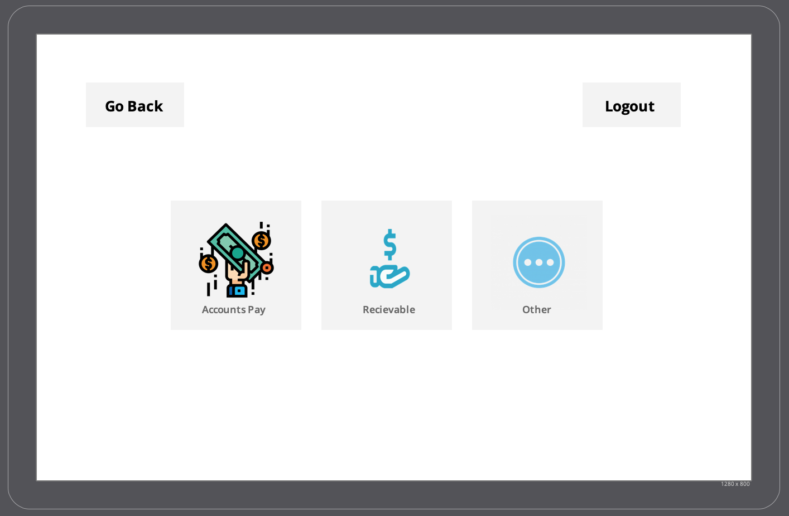
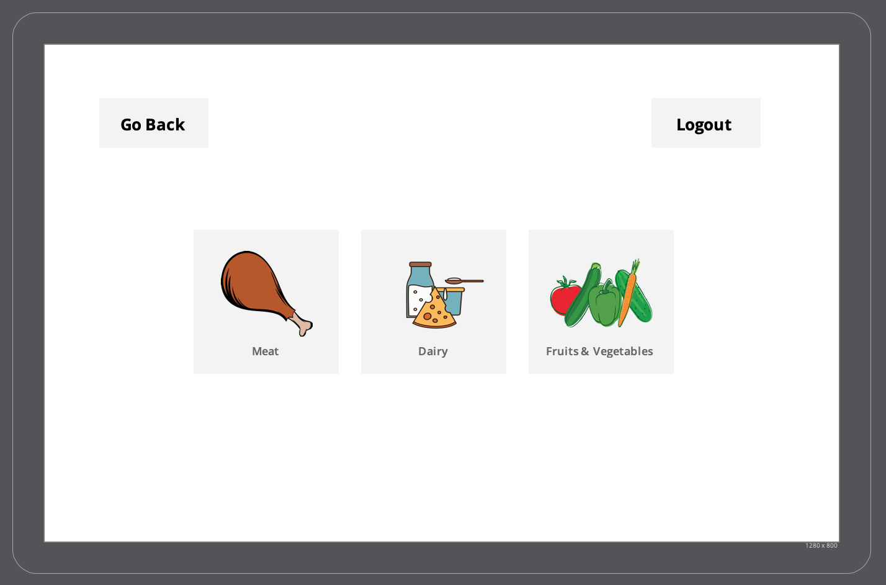
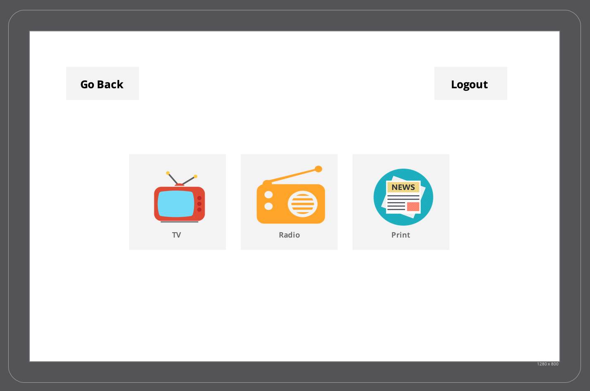
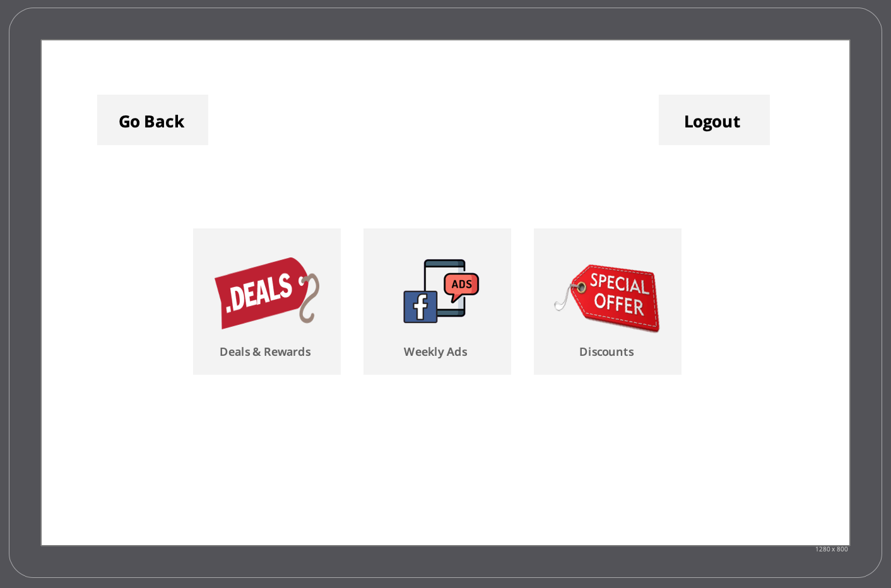
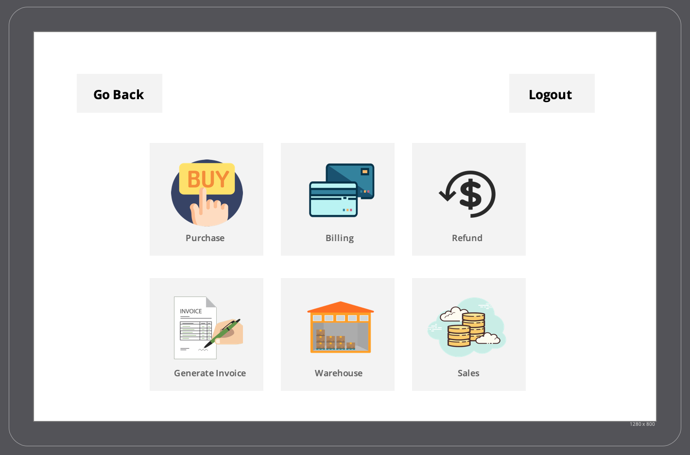

An Administrator is looking for some information in order to make some changes in the Human Resources section. He needs a few details on the amount of hours worked by an employee. Admin clicks on the 'Profile' button and logs in with his credentials. 

As soon as he logs in, he sees the following screen:

The administrator has some options to choose from, and he clicks on 'Human Resources' button and sees the following screen. 

Then has options such as Personnel, Payroll, and Hours Worked. He clicks on 'Hours Worked' to search for the information he is looking for. He updates some of the changes and let's his Human Resources team know.

Later, Admin needs to see updates on the Accounts pay. So, he will go back to the Admin page by clicking on the Back button. He then clicks on Accounting page and sees the following screen:

He is now able to click on "Accounts Pay" button to collect the information he is looking for.

One of the customers complained to the store about the quality of meat. Now, in order to see where does the meat comes from, the Admin would have see which vendor sends that particular meat. Admin can do so by going to the Admin Home Page and clicking on the Vendors button. Once, he clicks this, he will see the following screen:

He can chose from the options of Meat, Dairy, Fruits & Vegetables. He chooses Meat option to see from which vendor the store is receiving this meat.

Some of the best products from the store are featured on television and people are more likely to buy the products which are advertised good. The admin knows the upcoming products that will be high in demand and needs to be on television. He needs to contact the distributor of that television channel which will feature these products as advertisement. So, admin can do so by going on the Admin Home Page and cliking on the 'Advertisement' button. As soon as he clicks on it, he will see the following page:

On this page, he has options for Tv, Radio, and Print advertisements. He will then click on TV as that is the information he is looking for and then contact the distributor in order to get the products featured on TV.

This page is managed by the Admin to see the flyer and the items on sale for the upcoming weeks. The admin will click on Print tab to view the flyer of the store.

Discounts are the one of the best ways to get customers into the store and make them buy. Out store is doing amazing with the few discounts that were running in the past week. We have new products coming in and some of the unsold items needs to go on sale and put discounts on it. The discount feature will allow the admin to calculate discounts, create tags and print them. Admin can do so by going to the Admin Home Page, and then clicking on Promotions, which looks like the following screen:

Here, he can also choose options for Deals and Rewards that he can create or view, and Weekly Ads that are up and running and can be created for future use. Admin clicks on Discounts, calculates the discounds, and prints the discount tags.

Admin sees that some of the products in the store are going out of stock and will have to order new items before the weekend. He can do so by going to his Admin Page and Clicking on the 'Inventory' button. He will see the follwing screen as soon as he clicks Vendor: 

And then he is able to click on "Purchase" and further order the products from the correct vendor.