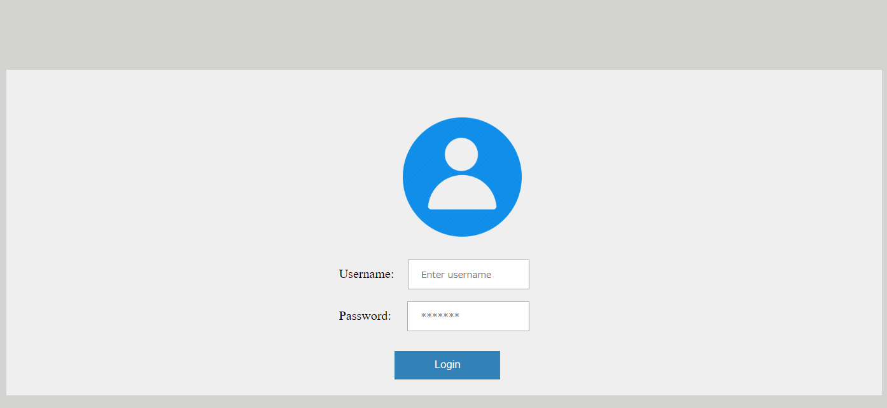
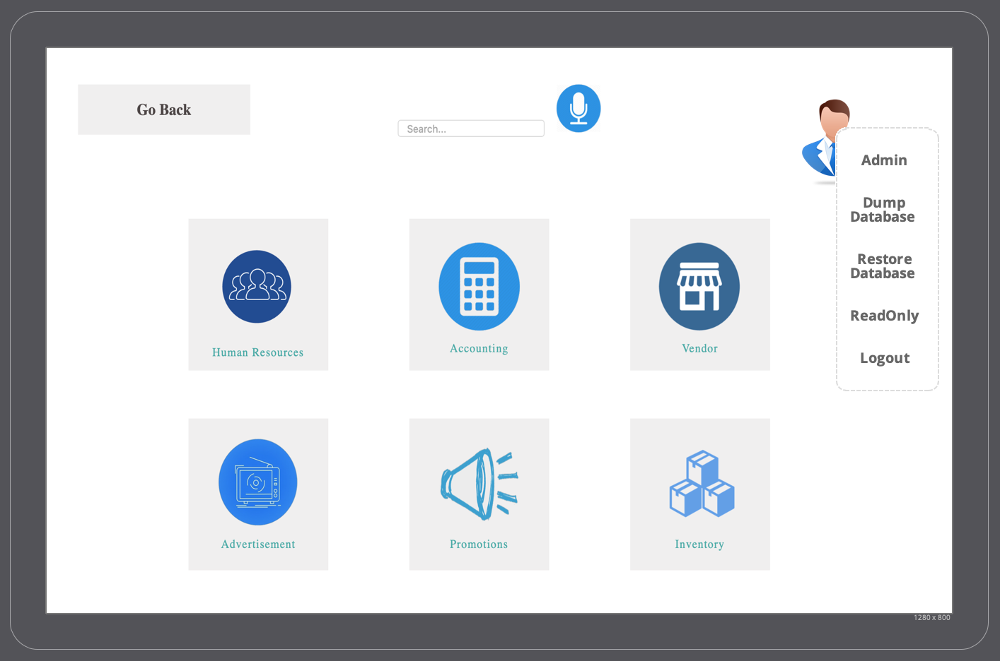
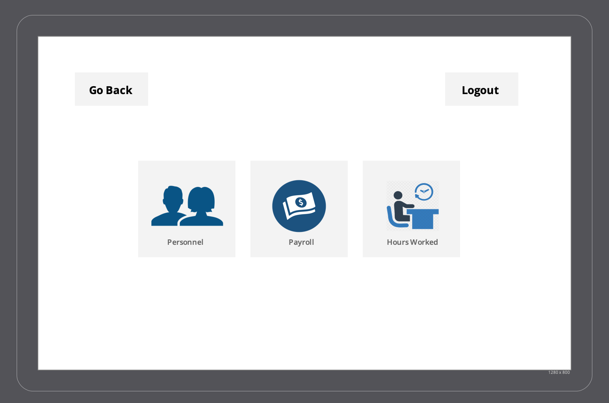

An Administrator is looking for some information in order to make some changes in the Human Resources section. He needs a few details on the amount of hours worked by an employee. Admin clicks on the 'Profile' button and logs in with his credentials. 

As soon as he logs in, he sees the following screen:

The administrator has some options to choose from, and he clicks on 'Human Resources' button and sees the following screen. 

Then has options such as Personnel, Payroll, and Hours Worked. He clicks on 'Hours Worked' to search for the information he is looking for. He updates some of the changes and let's his Human Resources team know.