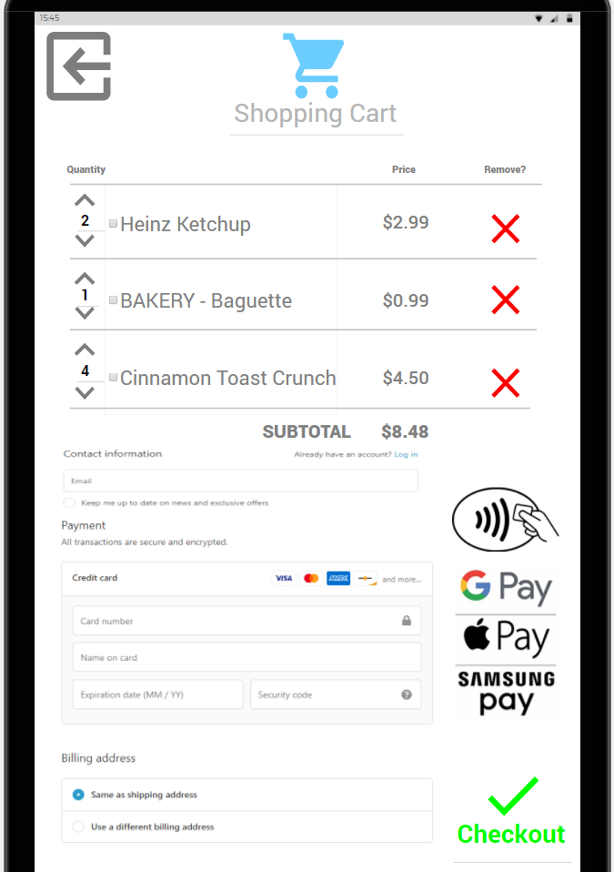

A customer is in a rush and wants to buy some snacks at Walmart. As soon as he enters the store, he notices a shopping cart which has a tablet device attached to it. He walks up to the tablet, and sees the following screen:

The customer would have the option to change the language if he wants to. This customer keeps the default English language and taps 'Touch To Start'. Once he taps the that button, he sees the following screen:

Then, he clicks on 'Profile'. There is a login page which looks like this:

He logs in with his Username and Password. As soon as he logs in, another page pops up. He would have a few options on the screen. He could View his Cart, Navigate through the store, view their personal profile, check the price of an item, request help from customer service, request help for Accessibility, or log out of the page. He is walking around and picks up a couple of items and scans it. He wants to make sure if he has the correct items scanned. He clicks on View Cart, and sees the following screen:

He can see the two items he scanned. Than, he clicks on the checkout button and checks out his purchased items. 

A customer is confused about where the Electronic section in Walmart is. The customer enters the store and sees the cart and clicks on Touch to Start, and sees an option that says "Navigation". The navigation button will direct the customer to the following page:

Here, the customer can see the full Walmart store map and where each item is placed within the store. The device would locate and once you click on the Electronics, it will give you a map from from starting point to the destination point.

A customer is trying something that is really heavy from the Lawn and Garden section. They are using SmartKart and sees an option for Request Help and click on that button. They would see the following screen:

From here, they can call an employee to assist them with anything.