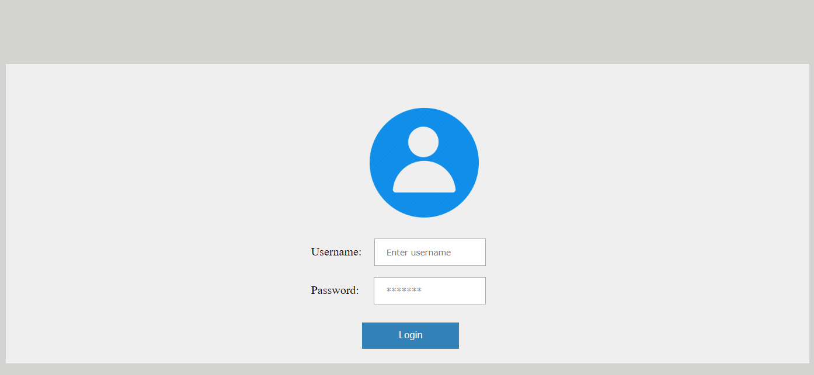
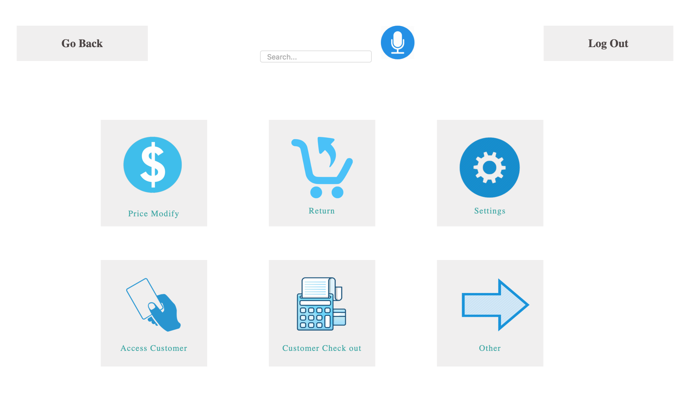
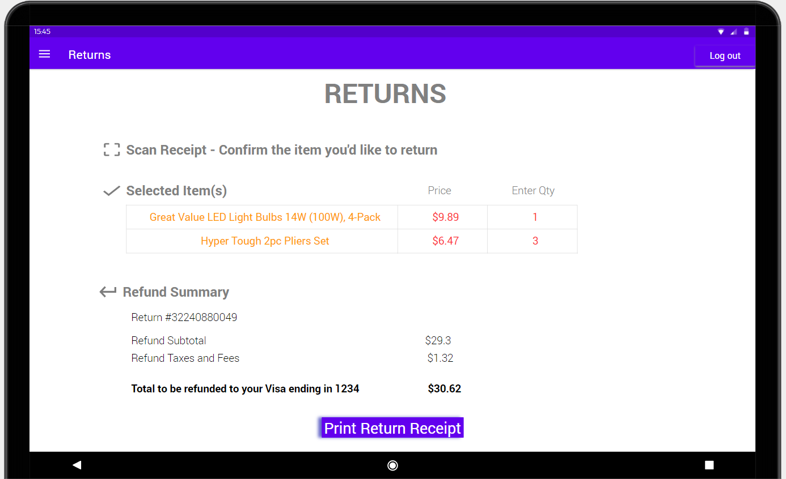

A Customer Service representative of Walmart is working at the Customer Service Section. A customer comes into the store with an item in her hand, she walks up to the Customer Service section and asks the representative to offer a full refund on the return she is trying to make. The employee clicks on the 'Profile' button on his screen and sees the following Login Page:

After logging in with his credentials, he sees the following Customer Service Page:

As Customer Service employees, they would have the options for modifying the price, do returns, have some settings options, access the customer account, checkout for the customer, and others. The employee then clicks on 'Return', and sees the following screen:

 Employee runs the return on the items successfully that the lady wanted to return. This makes the customery happy by quick and reliable service from Walmart using the SmartKart application.