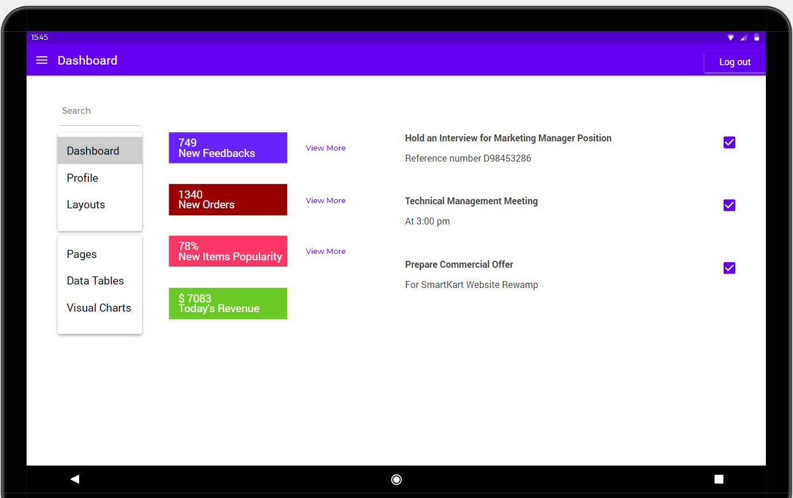

A Customer Service representative of Walmart is working at the Customer Service Section. A customer comes into the store with an item in her hand, she walks up to the Customer Service section and asks the representative to offer a full refund on the return she is trying to make. The employee clicks on the 'Profile' button on his screen and sees the following Login Page:

After logging in with his credentials, he sees the following Customer Service Page:

As Customer Service employees, they would have the options for modifying the price, do returns, have some settings options, access the customer account, checkout for the customer, and others. The employee then clicks on 'Return', and sees the following screen:

 Employee runs the return on the items successfully that the lady wanted to return. This makes the customery happy by quick and reliable service from Walmart using the SmartKart application.

 Later, a customer comes up to the customer service representative to make sure if the price of an item is correct. It turns out that the price was mistakenly incorrect and the employee would have to correct the price as soon as possible so that it doesn't affect the sale of the store. He does that by going to the Customer Service Home Page and then clicking on Price Modify, as soon as he click on it, he will see the following screen:

 

 Here, the employee will be able to select the product by scanning it and editing the price for it. 

 A Customer Service employee needed to see some updates on the number of feedbacks they have gotten in this week. These feedbacks could be crucial in maintaining the sales of the store and improving overall customer service. He can view this update by going to the Customer Service Home Page and clicking on the Setting Options. He will see the following screen:

  

 He can see the amount of feedbacks they have gotten, amount of New Orders that have been placed, popularity of the new items that were brought in, and total revenue for the day. They can also make some changes in their Profile, Layouts, Pages, Data Tables, and Visual Charts. Here, he clicks on the feedback button to see the new feedbacks the store have received.  

 A customer has changed their email address and they are already in the store for shopping. When they go to checkout they inform the employee to change their email address. The employee can change a customer's email address by going to the Customer Service Home Page and then clicking on the Access Customer button. Employee will see the following screen:

  

 Here, the employee can access Customer's information and can make changes to their account. Employee then edits the email address of Sara,and updates the information.

A customer is facing some problems regarding the checking out process. They go up to the Customer Service section for help and tells them to check out for them. The employee logs in into his profile and goes to the home page and click on the Customer Checkout button. He will see the following screen:

 

The employee is then able to scan the items and then select the payment method by which the customer wants to pay and then checks out the items for customer.
