# Sprint-03 Written Report

## Team 14 - SmartKart

* Developer - Aurangzeb Razzaq, arazzaq@hawk.iit.edu
  * Create a html page for Customer Service/Access Customer with editing the CSS file.
  * Create a html page for Customer Service/Checkout with editing the CSS file.
  * Create a html page for Customer Service/Price Modify with editing the CSS file.
  * Create a html page for Customer Service/Returns with editing the CSS file.
  * Create a html page for Customer Service/Settings with editing the CSS file.
  * Create a html page for Profile/Create an Account page with editing the CSS file.
* UI/UX Developer - Darsh Patel, dpatel137@hawk.iit.edu 
  * Create UI diagram for Customer Service/Access Customer page.
  * Create UI diagram for Customer Service/Checkout page.
  * Create UI diagram for Customer Service/Price Modify page.
  * Create UI diagram for Customer Service/Returns page.
  * Create UI diagram for Customer Service/Settings page.
  * Create UI diagram for Profile/Create an account page.
* Project Manager - Kajal Patel, kpatel115@hawk.iit.edu
  * Responsible for managing goals, communication methods, and achieving set goals for the sprint.
  * Responsible for getting resources for the team members. 
  * Responsible for preparing Reports and documentations on GitHub.
  * Responsible for allocating issues and issues tracking on GitHub.
  * Check for bugs or security issues/vulnerabilities in the code.
  * Test Responsive design for new features and discuss feedback with devOps.
* Jr. Developer - Ramzee Christiel, rchristiel@hawk.iit.edu 
  * Responsible for working with Developer to develop code for Profile/Create an Account page.
  * Working with UI/UX developer to assist with User Interface diagrams.
  * Develop detailed notes based on the diagrams from UI/UX Developer.
  * Testing the initial developed code for security vulnerabilities.
  * Create the html and CSS pages responsive design.
* IT Operations - Ashma Manandhar, amanandh@hawk.iit.edu
  * Responsible for ensuring and deploying infrastructure and code.
  * Responsible for ensuring all team members can deploy code locally.
  * Drawing Infrastructure diagrams.
  * Responsible for researching Load balancer and implementing its use.
  * Responsible for populating database.
  * implement database with master/slave replication.

## Project Manager Report

1. Place images of the full User & Admin and/or anonymous story here with annotations of the functioning and the non-functioning portions as necessary (can reuse the artifact created by UI/UX)

* Customer User Story

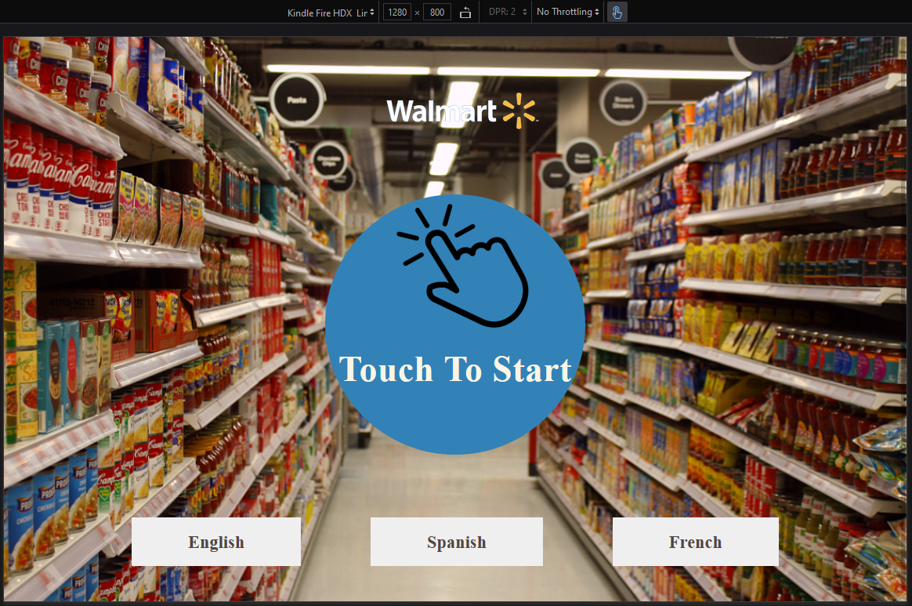
* As soon as the customer enters the store, a shopping cart which has a tablet device attached to it is placed by the entrance. This is the homepage of a Customer.

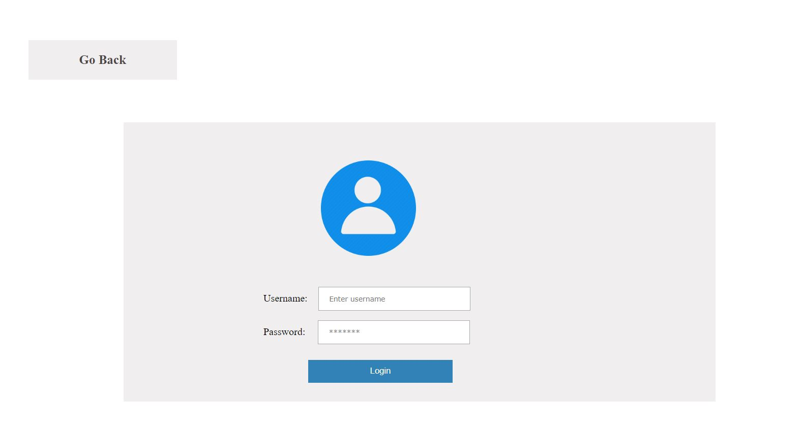
* The cutomer will log in using their username and password.

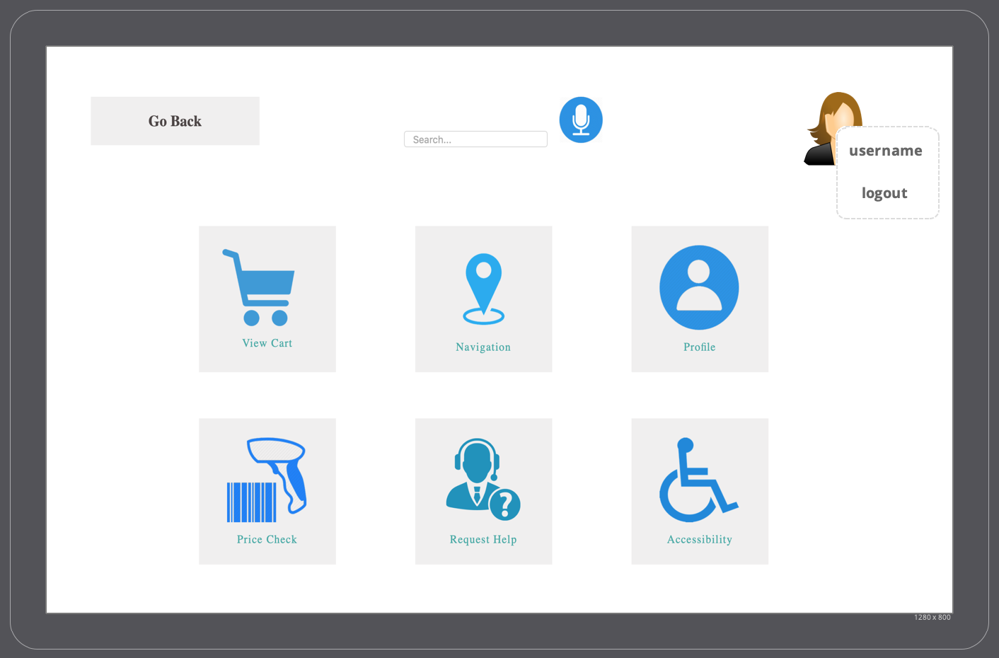
* As soon as the customer logs in, the page above will pop up. The customer would have a few options on the screen. He could View his Cart, Navigate through the store, view their personal profile, check the price of an item, request help from customer service, request help for Accessibility, or log out of the page.

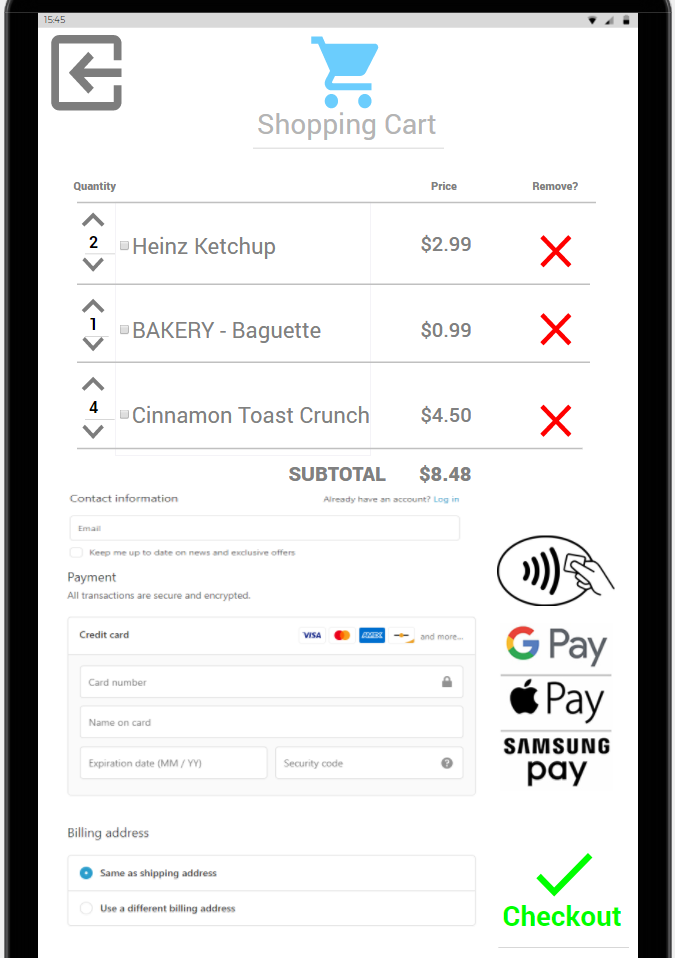
* This is how the View Cart page looks like. 

* We have not completed the whole Customer User story yet.

* Admin User Story


* Admin will use their username and password to Log In to the system. This is the log in page.


* This is the main homepage of an Admin User Story.


* The admin has some options to choose from, and he clicks on 'Human Resources' button and sees the  screen above. 


* Next, he clicks on Accounting and sees the page above.


* Next, he clicks on Vendor and sees the page above.


* Next, he clicks on Advertisement and sees the page above.


* Next, he clicks on Promotions and sees the page above.


* Next, he clicks on Inventory and sees the page above.

* Customer Service User Story


* The Customer Service representative will log into this page by using their username and password.

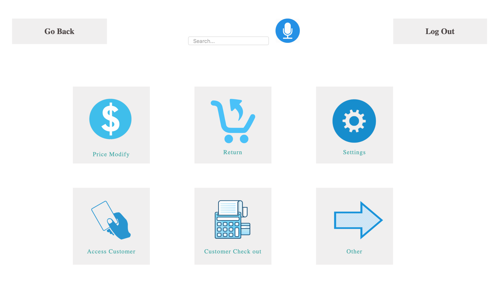
* This is the main homepage for the Customer Service.

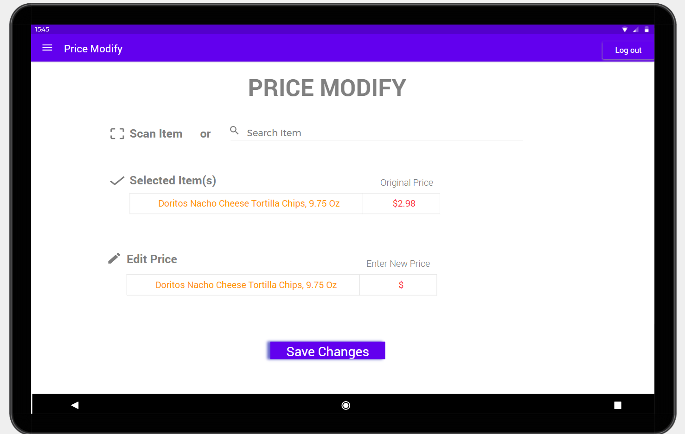
* Next, he clicks on Price Modify and sees the page above. 


* Next, he clicks on Price Modify and sees the page above.

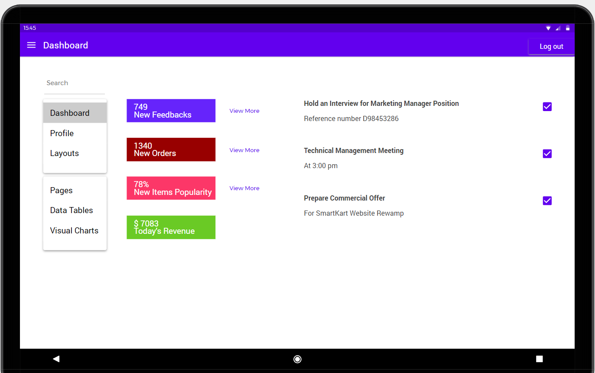
* Next, he clicks on Settings and sees the page above.


* Next, he clicks on Access Customer and sees the page above.

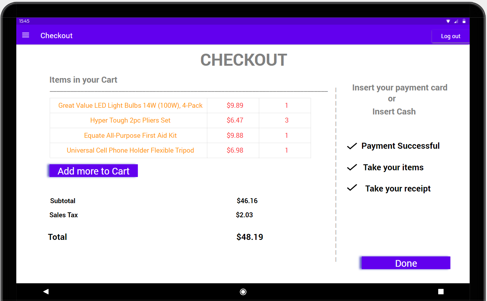
* Next, he clicks on Customer Checkout and sees the page above.

2. Include a file  ```install.md``` in the root of the team GitHub Repo detailing all instructions to build and run the functioning parts of your site

* The install.md file is in the root of the team GitHub Repo. Please check there to read the details and instructions to build and run the fuctioning parts of the site provided on instll.md file.

3. Verify that all defined minimum goals were met and explain goals that were reached beyond what was defined.  Also explain reasons behind goals that were not met.

* The minimum goals defined in the beginning of the report are listed below. The goals are titled with the appropriate role followed with artifact screenshots of minimum goals completed.
* The goal that was reached beyond what was defined is to ensure we had credintials for all 3 users connected to the database. The IT operational researched and coded beyond what was expected to connect sql.
* The goal that was not met for this sprint is to make all the html pages under customer service responsive to tablet size. The junior developer and I could not communicate on this goal very well therefore we could not meet this goal. Another goal that was not met was to test the initial developed code for security vulnerabilities as I could not communicate with the Junior Developer.

4. List any detailed assumptions your team made explaining deliverable context as needed

* The biggest assumption my team made was to make all the html pages responsive design. Since the tablet fits best for our project, my team decided to continue this project further with a web application on an amazon tablet. According to the privious code, all of our html pages were responsive to desktop computer. For this sprint, our assumption was to have all the html pages responsive to tablet so we can test it out for better understanding of the customer's experience. 

5. List Atomic goals for sprint-04

* Project Manager
1. Create a document to get prepared for live demonstration using a tablet.  
2. Update the install.md file in github. 
3. Create Sprint 4 report.
4. Assist team members where needed.
* UI/UX 
1. Create design for new features on Customer/Nevigation page.
2. Create design for new features on customer/Request Help page.
3. Create design for new features on customer/Accessibility page.
4. When transitioning to new position debrief personal notes pertaining to project two new successor.
* Developer
1. Prepare HTML file for Nevigation with editing the CSS & JavaScript file.
2. Prepare HTML file for Request Help with editing the CSS & JavaScript file.
3. Prepare HTML file for Accessibility with editing the CSS & JavaScript file.
4. When transitioning to new position debrief personal notes pertaining to project two new successor.
* JR. Developer
1. Communicate with developer and supplement developers responsibilities.
2. Ensure that all new HTML files have responsive CSS code.
3. Test responsive designs.
4. When transitioning to new position debrief personal notes pertaining to project two new successor.
* IT Infrastructure
1. Deploy code to machine for testing the three users.
2. Test responsive designs to tablet.
3. Install load balancer
4. Implement SQRL security
5. When transitioning to new position debrief personal notes pertaining to project two new successor.

* Responsible for managing goals, communication methods, and achieving set goals for the sprint.
  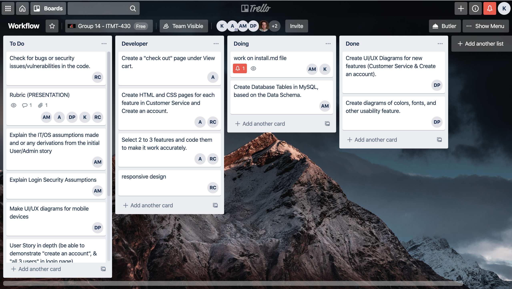
  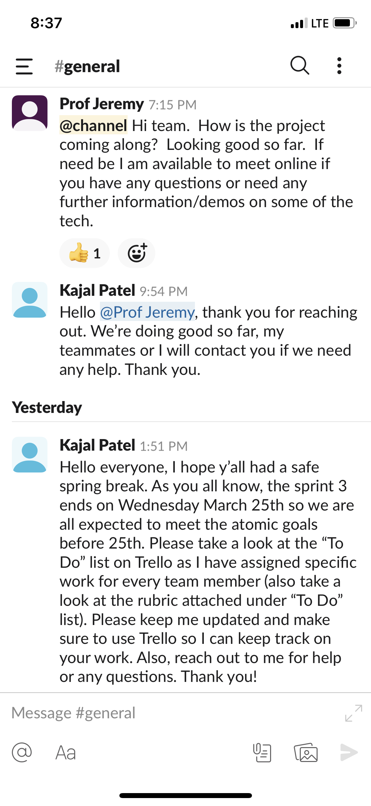

### UI/UX Artifacts

Place links and or screenshots to minimum of **4** artifacts here. Artifacts are defined as GitHub commit URL and Project Management Tool Kanban board images (Trello or JIRA).

User stories needs to be included in the *diagrams* folder but **not** included in the report section under UI/UX

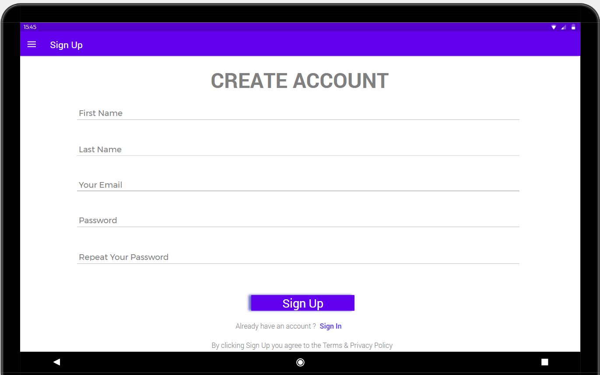
* Created UI diagram for Profile/Create an Account page.


* Created UI diagram for Customer Service/Access Customer info page.


* Created UI diagram for Customer Service/Checkout page.


* Created UI diagram for Customer Service/Price Modify page.


* Created UI diagram for Customer Service/Returns page.


* Created UI diagram for Customer Service/Settings page.

### Infrastructure

Place links and or screenshots to minimum of **5** artifacts here. Artifacts are defined as GitHub commit URL and Project Management Tool Kanban board images (Trello or JIRA).

* Populate users to test and fixed sql syntax 
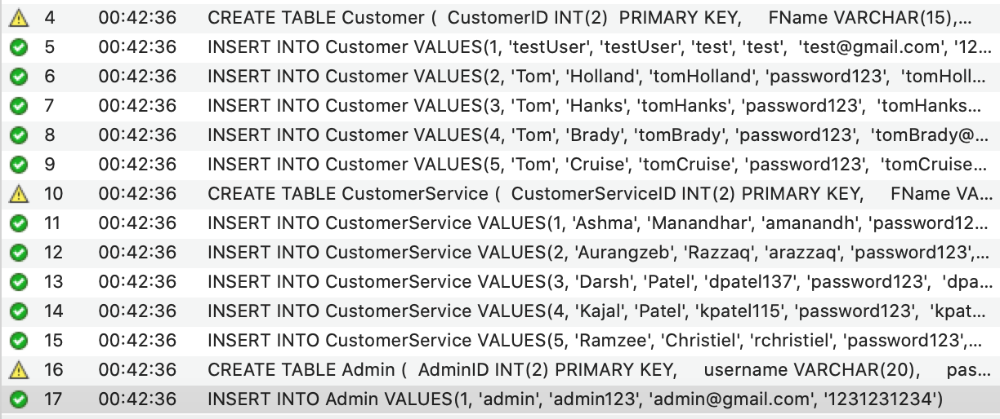

* Build app on local host and successfully connect to the database.
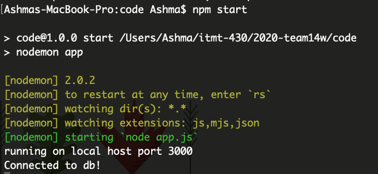

### Developer

Place links and or screenshots to minimum of **5** artifacts here. Artifacts are defined as GitHub commit URL and Project Management Tool Kanban board images (Trello or JIRA).

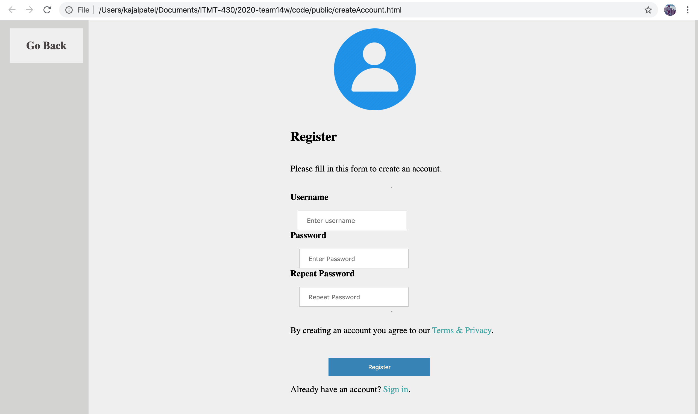
* Create a html page for Profile/Create an Account page with editing the CSS file.

### Junior Developer

Place links and or screenshots to minimum of **4** artifacts here.  Artifacts are defined as GitHub commit URL and Project Management Tool Kanban board images (Trello or JIRA).

Place screen shot to image of a minimum of 5 GitHub issues/bugs reported and assigned

* Moving all the classes and labs online due to global situation, I was not able to reach out to junior developer before the due date. As a project manager, I was not able to communicate with my Junior Developer to meet the defined minimum goals for this spint. Therefore, this section has been left blank and the future junior developer will take the work further.