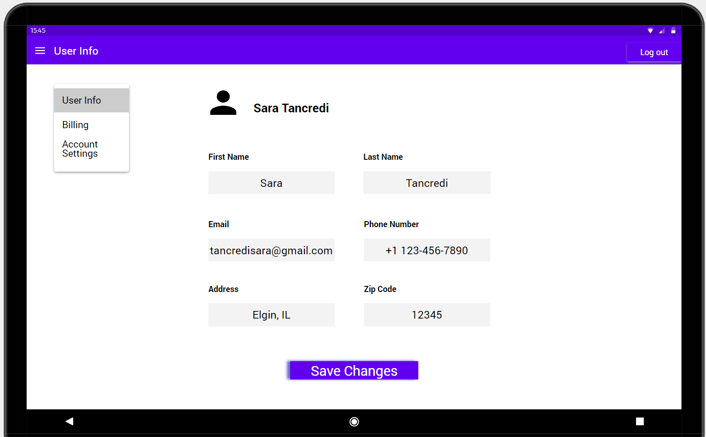

# Sprint-03 Written Report

## Team 14 - SmartKart

* Developer - Aurangzeb Razzaq, arazzaq@hawk.iit.edu
  * Create a html page for Customer Service/Access Customer with editing the CSS file.
  * Create a html page for Customer Service/Checkout with editing the CSS file.
  * Create a html page for Customer Service/Price Modify with editing the CSS file.
  * Create a html page for Customer Service/Returns with editing the CSS file.
  * Create a html page for Customer Service/Settings with editing the CSS file.
  * Create a html page for Profile/Create an Account page with editing the CSS file.
* UI/UX Developer - Darsh Patel, dpatel137@hawk.iit.edu 
  * Create UI diagram for Customer Service/Access Customer page.
  * Create UI diagram for Customer Service/Checkout page.
  * Create UI diagram for Customer Service/Price Modify page.
  * Create UI diagram for Customer Service/Returns page.
  * Create UI diagram for Customer Service/Settings page.
  * Create UI diagram for Profile/Create an account page.
* Project Manager - Kajal Patel, kpatel115@hawk.iit.edu
  * Responsible for managing goals, communication methods, and achieving set goals for the sprint.
  * Responsible for getting resources for the team members. 
  * Responsible for preparing Reports and documentations on GitHub.
  * Responsible for allocating issues and issues tracking on GitHub.
  * Check for bugs or security issues/vulnerabilities in the code.
  * Test Responsive design for new features and discuss feedback with devOps.
* Jr. Developer - Ramzee Christiel, rchristiel@hawk.iit.edu 
  * Responsible for working with Developer to develop code for Profile/Create an Account page.
  * Working with UI/UX developer to assist with User Interface diagrams.
  * Develop detailed notes based on the diagrams from UI/UX Developer.
  * Testing the initial developed code for security vulnerabilities.
  * Create the html and CSS pages responsive design.
* IT Operations - Ashma Manandhar, amanandh@hawk.iit.edu
  * Responsible for ensuring and deploying infrastructure and code.
  * Responsible for ensuring all team members can deploy code locally.
  * Drawing Infrastructure diagrams.
  * Responsible for researching Load balancer and implementing its use.
  * Responsible for populating database.
  * implement database with master/slave replication.

## Project Manager Report

1. Place images of the full User & Admin and/or anonymous story here with annotations of the functioning and the non-functioning portions as necessary (can reuse the artifact created by UI/UX)
1. Include a file  ```install.md``` in the root of the team GitHub Repo detailing all instructions to build and run the functioning parts of your site
1. Verify that all defined minimum goals were met and explain goals that were reached beyond what was defined.  Also explain reasons behind goals that were not met.
1. List any detailed assumptions your team made explaining deliverable context as needed
1. Responsible for managing goals, communication methods, and achieving set goals for the sprint.
  
  
1. List Atomic goals for sprint-04
* Project Manager
1. Create a document to get prepared for live demonstration.  
2. Update the install.md file in github. 
3. Create Sprint 4 report.
4. Assist team members where needed.
* UI/UX 
1. Create design for new features on Customer/Nevigation page.
2. Create design for new features on customer/Request Help page.
3. Create design for new features on customer/Accessibility page.
4. When transitioning to new position debrief personal notes pertaining to project two new successor.
* Developer
1. Prepare HTML file for Nevigation with editing the CSS & JavaScript file.
2. Prepare HTML file for Request Help with editing the CSS & JavaScript file.
3. Prepare HTML file for Accessibility with editing the CSS & JavaScript file.
4. When transitioning to new position debrief personal notes pertaining to project two new successor.
* JR. Developer
1. Communicate with developer and supplement developers responsibilities.
2. Ensure that all new HTML files have responsive CSS code.
3. Test responsive designs.
4. When transitioning to new position debrief personal notes pertaining to project two new successor.
* IT Infrastructure
1. Deploy code to machine for testing the three users.
2. Test responsive designs.
3. Install load balancer
4. Implement SQRL security
5. When transitioning to new position debrief personal notes pertaining to project two new successor.


### UI/UX Artifacts

Place links and or screenshots to minimum of **4** artifacts here. Artifacts are defined as GitHub commit URL and Project Management Tool Kanban board images (Trello or JIRA).

User stories needs to be included in the *diagrams* folder but **not** included in the report section under UI/UX


* Created UI diagram for Profile/Create an Account page.


* Created UI diagram for Customer Service/Access Customer info page.


* Created UI diagram for Customer Service/Checkout page.


* Created UI diagram for Customer Service/Price Modify page.


* Created UI diagram for Customer Service/Returns page.


* Created UI diagram for Customer Service/Settings page.

### Infrastructure

Place links and or screenshots to minimum of **5** artifacts here. Artifacts are defined as GitHub commit URL and Project Management Tool Kanban board images (Trello or JIRA).

### Developer

Place links and or screenshots to minimum of **5** artifacts here. Artifacts are defined as GitHub commit URL and Project Management Tool Kanban board images (Trello or JIRA).

### Junior Developer

Place links and or screenshots to minimum of **4** artifacts here.  Artifacts are defined as GitHub commit URL and Project Management Tool Kanban board images (Trello or JIRA).

Place screen shot to image of a minimum of 5 GitHub issues/bugs reported and assigned
