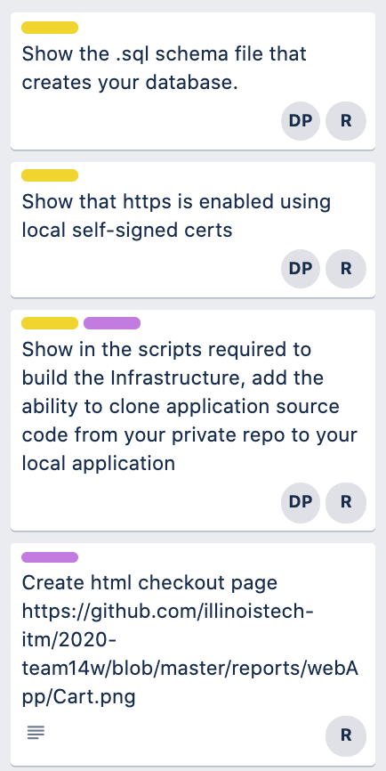
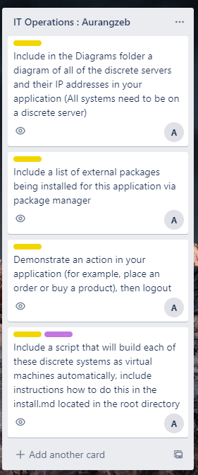
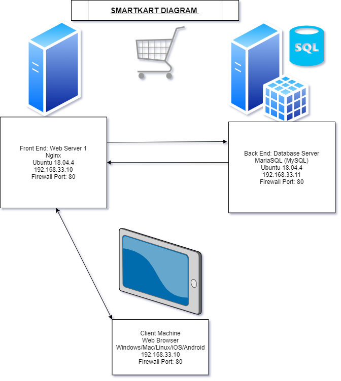
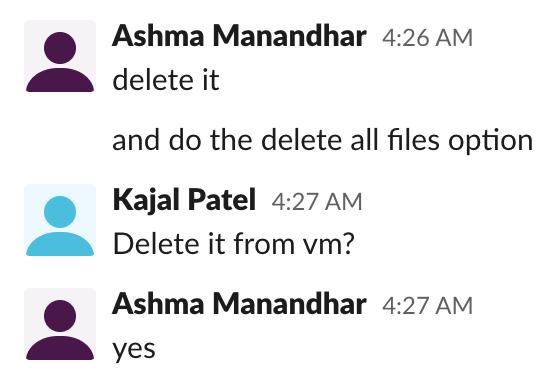

# Sprint-04 Report

## Team 14 - SmartKart

### Team Members

* Developer - Ramzee Christiel, rchristiel@hawk.iit.edu
* UI/UX Developer - Kajal Patel, kpatel115@hawk.iit.edu
* Project Manager - Ashma Manandhar, amanandh@hawk.iit.edu
* Jr. Developer - Darsh Patel, dpatel137@hawk.iit.edu
* IT Operations - Aurangzeb Razzaq, arazzaq@hawk.iit.edu

 ## UI/UX Report

* Github commits and Trello artifacts

* Customer Story
 

* Admin Story

## Developer Report

* Github commits and Trello artifacts

* Created Checkout page

## IT Infrastructure Report

* Github commits and Trello artifacts

* Install instructions in install.md

* Diagram of IP Address

## Jr. Developer

* Github commits and Trello artifacts

* Reported 5 bugs/issues

* Responsive design

## Project Manager Report

* Github commits and Trello artifacts

* Install instructions in install.md

* Kept Communication with team 

* Help team build app in their computers 

## Assumptions

- We are assuming that users are able to great a ssh key and deploy from our private github repos.
- The app doesn't connect with the sql database yet so another assumption is that it will successfully connect with the database next sprint and users will be able to login and logout 

