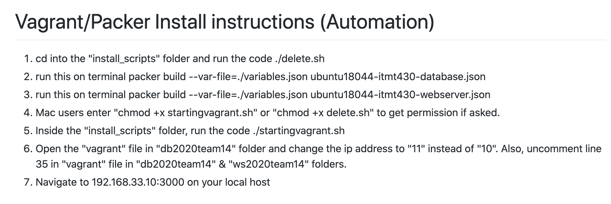
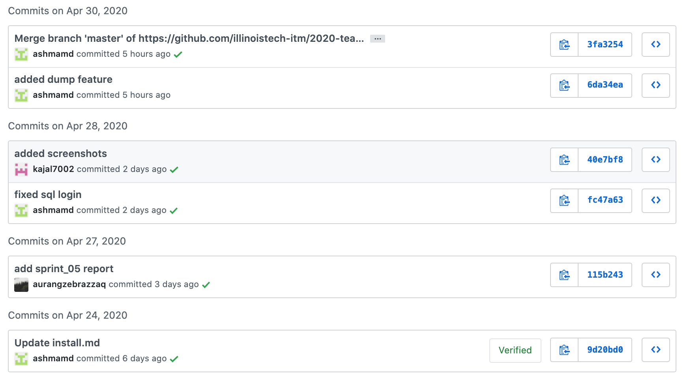
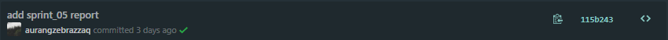
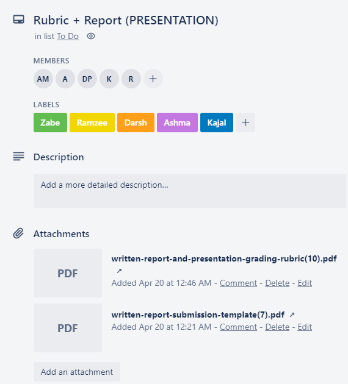
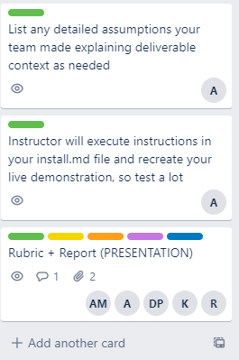
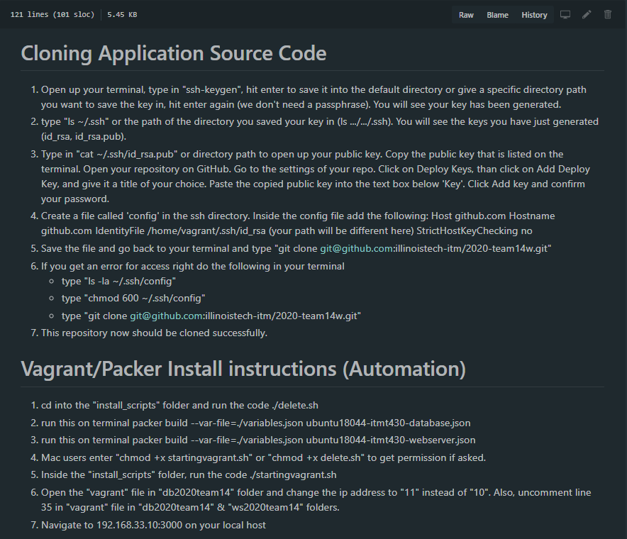
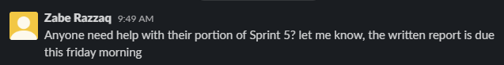

# Sprint-05 Report

## Team 14 - SmartKart

### Team Members

* UI/UX Developer - Ramzee Christiel, rchristiel@hawk.iit.edu
* IT Operations - Kajal Patel, kpatel115@hawk.iit.edu
* Jr. Developer - Ashma Manandhar, amanandh@hawk.iit.edu
* Developer - Darsh Patel, dpatel137@hawk.iit.edu
* Project Manager - Aurangzeb Razzaq, arazzaq@hawk.iit.edu

## UI/UX Report

* Github commits and Trello artifacts

* Customer Story

* Admin/Anonymous Story

* 5 GitHub issues/bugs reported, assigned, and resolved

## Developer Report

* Github commits and Trello artifacts

* Show in the scripts required to build the Infrastructure, how you added the ability to clone application source code from your private repo to your local application

* Creation of a non-root Database user and brief explanation for the permissions granted
  * A non-root database user is the Customer Service department because they would require some access to the database in order to process information for the employees, inventory, and pay roll. The permissions granted to the Customer Service are Create, Create View, Alter, Select, Insert, Show Database, and Update. 

## IT Infrastructure Report

* Github commits and Trello artifacts

* Included a script that will build each of these discrete systems as virtual machines automatically.

* Diagram of all discrete servers and their IP Addresses

* Included a list of external packages.

## Jr. Developer

* Github commits and Trello artifacts

* Feature for Admin to export the entire database to a local file

  * Dumps database when app runs (not upon admin clicking dump database)  

* 2 actions per user for "test" accounts upon deployment of SmartKart
  * Not able to do/test this since automation does not work
* Database Encryption Report
   ---- 

## Project Manager Report

* Github commits

* Trello artifacts

* Install instructions in install.md

* Communication

## Assumptions

- Assumption that users/administrators are able to create a ssh key and deploy from our private github repositories
- Assumption that administrators will have the database/webserver running and networked with all SmartKart shopping carts
