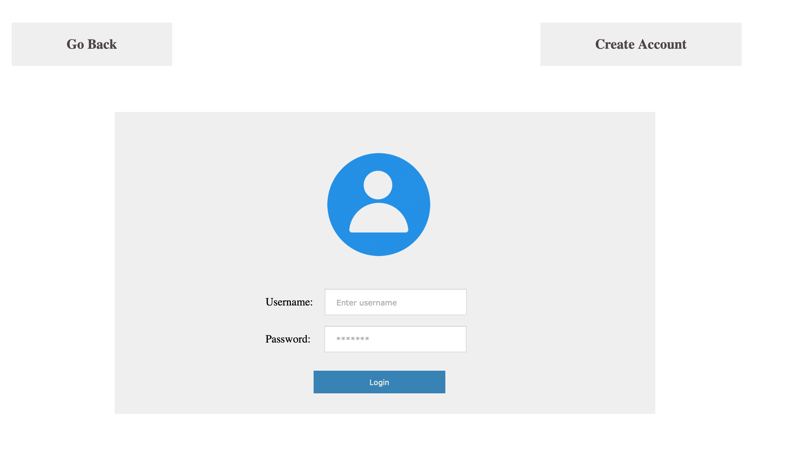

# Sprint-01 Report

## Team 14 - SmartKart

### Team Members

* Developer - Ashma Manandhar, amanandh@hawk.iit.edu
  * Responsible for developing code based on UI/UX diagrams
  * Responsible for consistent code commitment for Sprint 1
* UI/UX Developer - Aurangzeb Razzaq, arazzaq@hawk.iit.edu
  * Responsible for designing UI/UX diagrams of the project
  * Creative a testing responsive design
  * Responsible for user testing and filing of issue on GitHub Issues
* Project Manager - Darsh Patel, dpatel137@hawk.iit.edu
  * Responsible for managing goals, communication methods, and achieving set goals
  * Responsible for getting resources for the team
  * Responsible for preparing Reports and documentations
  * Responsible for allocating issues and issues tracking on GitHub
* Jr. Developer - Kajal Patel, kpatel115@hawk.iit.edu
  * Responsible for working with Developer to develop code 
  * Working with UI/UX developer to assist with User Interface diagrams
  * Testing the initial developed code for security vulnerabilities
* IT Operations - Ramzee Christiel, rchristiel@hawk.iit.edu
  * Responsible for ensuring and deploying infrastructure and code
  * Responsible for ensuring al team members can deploy code locally
  * Drawing Infrastructure diagrams 

 ## UI/UX Report
  * Drafted and worked alongside the Jr. Developer in designing the Graphical User Interface
  * Utilized a design program called Justinmind for drafting the design and determining the color scheme and layout
  * Incorporated the three languages our team decided that we will support (English, Spanish, and French) in the splash screen layout
  * Collaborated with the Jr. Developer on the order and functions of the buttons featured on the main page and shopping cart
  * Sent the UI/UX designs to the Lead Developer for incorporation in the team project
    * included prototype sitemap
  * Created Slack Workspace (Connected Trello/GitHub)
  * Created Google Team Drive
  * Created Trello Board

## Developer Report
  * Coded in HTML, CSS and JS to make a website based on discussions and the UI/UX diagrams. 
  * Created an index.html that leads to all the different pages (starting page, main page, view shopping cart, customer profile, admin, customer service and the different language pages).
  * Showed consistent code commitments on GitHub.

## IT Infrastructure Report
  * (During the initial process, I was able to brainstorm ideas with the team, we choose rolls/duties. We came up with an idea to create a mobile app that would serve as a Grocery's AI. Used as a mobile interface that's designed to cut shopper's shopping time by 50%. As the IT operator, this Spring I was able to choose database software that's conducive to our goals with the project, map the database, provide comprehensive diagrams associated with the data storage and the IT infrastructure of our first prototype. Also, was able to research the security options provided by our advising professor, Jeremy Hajek. I recommended that we implement SQRL. ) 

## Jr. Developer
  * First, I sat down with an UI/UX Developer to design the user-friendly front end of our Web App. Together, we designed the homepage of our Web App. Taking every detail in encounter such as language preferred by the customer, symbols to navigate to an individual page, a microphone on top right hand side to make the process of checkout faster and convenient. As the UI/UX Developer was designing the page, I was taking notes of each element in detail to pass on the information to the Developer. Using Trello and Slack, I successfully attached the word document of the notes so the Developer can start coding. 
  * Homepage: 
    * A background image of a grocery store
    * “Tap to Start” click symbol in the middle 
    * Choose the language to continue shopping 
      * English
      * French
      * Spanish 
  * Index page:
    * Top right hand side: a microphone symbol to continue shopping by voice recording
    * Total of 6 symbol that leads into their own individual page
      * Shopping card: The items scanned then placed into the shopping cart
      * Navigation: Search for the item to see its location 
      * Account: Log in to your account using username & Password to get discounted prices
      * Price check: Simply scan the barcode of a product to see the price
      * Help: Call a Customer Service Representative for any help
      * Disability/senior: Call a Customer Service Representative for any help 

## Project Manager Report
  * Created and managed tasks in Trello.
  * Communicated with Team members for goal setting and deadlines using email.
  * Suggested online software/website options for creating Infrastructure and Database diagrams.
  * Created GitHub folders in team Repository as per Professor Jeremy's requirements and added diagrams to the GitHub that were provided to me by team members.
  * Prepared the 'Sprint 1 Written Report'.
  * Created a User Story to present for Sprint 1 presentations. 
  * Checked for bugs and issues on GitHub.   
  * Documented each task that was accomplished by each team member to ensure completion of Sprint 1 successfully.  

## Developer and Security Assumptions
We will be using SQRL (Secure, Quick, Reliable, Login) for secure website login and authentication. It is an open, free, intellectual property unencumbered, complete and practical system to cryptographically authenticate the identity of individuals across a network. SQRL may be used alongside other traditional website sign-in systems, and it can replace all other systems while offering dramatic improvements in usability and security. 

## Customer Story
A customer is in a rush and wants to buy some snacks at Walmart. As soon as he enters the store, he notices a shopping cart which has a tablet device attached to it. He walks up to the tablet, and sees the following screen:

The customer would have the option to change the language if he wants to. This customer keeps the default English language and taps 'Touch To Start'. Once he taps the that button, he sees the following screen:

Then, he clicks on 'Profile'. There is a login page which looks like this:

He logs in with his Username and Password. As soon as he logs in, another page pops up. He would have a few options on the screen. He could View his Cart, Navigate through the store, view their personal profile, check the price of an item, request help from customer service, request help for Accessibility, or log out of the page. He is walking around and picks up a couple of items and scans it. He wants to make sure if he has the correct items scanned. He clicks on View Cart, and sees the following screen:

He can see the two items he scanned. Than, he clicks on the checkout button and checks out his purchased items.  

## Customer Service Story
A Customer Service representative of Walmart is working at the Customer Service Section. A customer comes into the store with an item in her hand, she walks up to the Customer Service section and asks the representative to offer a full refund on the return she is trying to make. The employee takes the item from her, scans it, clicks on the 'Profile' button on his screen and sees the following Login Page:

After logging in with his credentials, he sees the following Customer Service Page:

As Customer Service employees, they would have the options for modifying the price, do returns, settings, access the customer account, checkout for the customer, and other. The employee then clicks on 'Return', runs the return on the item successfully the lady wanted to return.

## Administrator Story

## Atomic Goals for Sprint-02
* Create UI/UX Diagrams for each feature in our Web App.
* UI/UX diagrams of the 'Profile' page should include Unauthenticated users, Authenticated users, and administrative users.
* Create HTML and CSS pages for each feature (View Cart, Navigation, Profile, Price Check, Request Help, Accessibility). 
* Create Database Tables in MySQL, based on the Data Schema.
* User Story in depth (including more features that a user can use). 
* Implementing Secure Transaction method in our Web App.

## References
* Professor Jeremy Hajek
* https://www.theverge.com/2019/1/10/18177020/caper-labs-smart-shopping-cart-image-recognition-weight-sensor
* https://www.engadget.com/2019/01/11/caper-smart-shopping-cart/
* https://www.justinmind.com/