# Sprint-02 Report

## Team 14 - SmartKart

### Team Members
* Developer - Kajal Patel, kpatel115@hawk.iit.edu
  * Responsible for developing code based on UI/UX diagrams
  * Responsible for consistent code commitment for Sprint 1
  * Created a html page for Admin/Human Resources with editing the CSS file.
  * Created a html page for Admin/Vendor with editing the CSS file.
  * Created a html page for Admin/Advertisement with editing the CSS file.
  * Create a html page for Admin/Inventory with editing the CSS file.
* UI/UX Developer - Ashma Manandhar, amanandh@hawk.iit.edu 
  * Responsible for designing UI/UX diagrams of the project
  * Created and tested responsive design
  * Responsible for user testing 
  * Create UI diagram for administrative users with database dump, restore and read features.
  * Created UI diagram for Authenticated and Unauthenticated users.
  * Created UI diagram for when user if kicked out if user not in session.
  * Created other UI/UX diagrams for other screens and relayed information to developing team.
* Project Manager - Ramzee Christiel, rchristiel@hawk.iit.edu
  * Responsible for managing goals, communication methods, and achieving set goals
  * Responsible for getting resources for the team
  * Responsible for preparing Reports and documentations
  * Responsible for allocating issues and issues tracking on GitHub
  * Check for bugs or security issues/vulnerabilities in the code.
  * Test Responsive design for new features and discuss feedback with devOps.
* Jr. Developer - Aurangzeb Razzaq, arazzaq@hawk.iit.edu 
  * Responsible for working with Developer to develop code. 
  * Working with UI/UX developer to assist with User Interface diagrams.
  * Testing the initial developed code for security vulnerabilities.
  * Make the HTML and CSS pages responsive design.
  * Develop detailed notes based on the diagrams from UI/UX Developer.
  * Create diagrams of colors, fonts, and other usability feature.
* IT Operations - Darsh Patel, dpatel137@hawk.iit.edu
  * Responsible for ensuring and deploying infrastructure and code.
  * Responsible for ensuring all team members can deploy code locally.
  * Drawing Infrastructure diagrams.
  * Responsible for researching Load balancer and implementing its use.
  * Responsible for populating database.
  * implement database with master/slave repicaltion.

## Project Manager Report
  * Responsible for managing goals, communication methods, and achieving set goals
  * Responsible for getting resources for the team
  * Responsible for preparing Reports and documentations
  * Responsible for allocating issues and issues tracking on GitHub
  * Check for bugs or security issues/vulnerabilities in the code.
  * Test Responsive design for new features and discuss feedback with devOps.
    .png)

## Atomic Goals for Sprint-03

### Project Manager
1. Create a scope of work to divide amongst team members based on current status. 
2. Create gitnore file in github. 
3. Create Sprint 3 report
4. Assist team members where needed.
### UI/UX 
1. Create design for new features on admin page.
2. Create design for new features on customer servicepage
3. Create front-end user test.
4. When transitioning to new position debrief personal notes pertaining to project two new successor.
## Developer
1. Prepare HTML file for inventory
2. Add style to new HTML files through CSS
3. Add relevant code to JavaScript file
## JR. Developer
1. Communicate with developer and supplement developers responsibilities
2. Ensure that all new HTML files have responsive CSS code relevant to it
3. Test responsive designs and all three formats
## IT Infrastructure
1. Deplore code to machine for testing
2. Test responsive design
3. Install load balancer
## UI/UX Report

List all atomic goals for UI/UX for this sprint and the artifacts that completed them.  Explain any design assumptions made and or any derivations from the initial User/Admin story.

* Create UI diagram for administrative users with database dump, restore and read features.
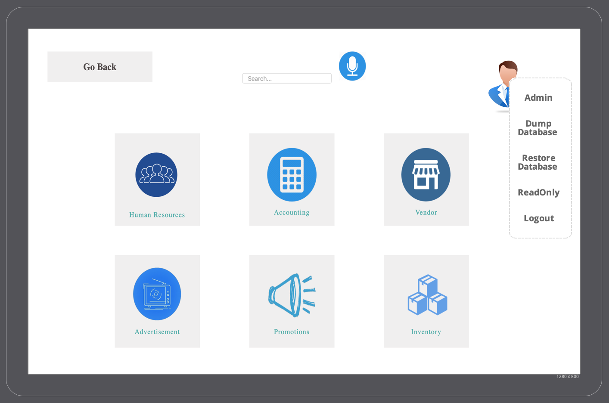
* Created UI diagram for Authenticated and Unauthenticated users.
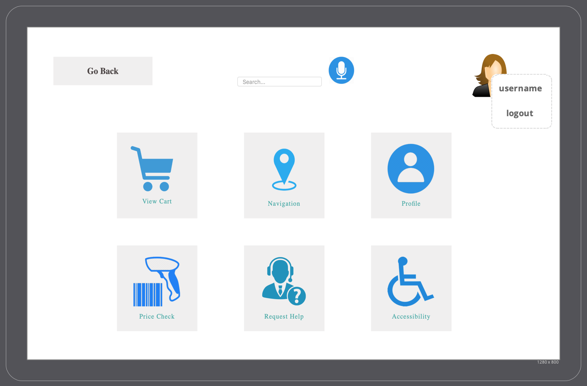
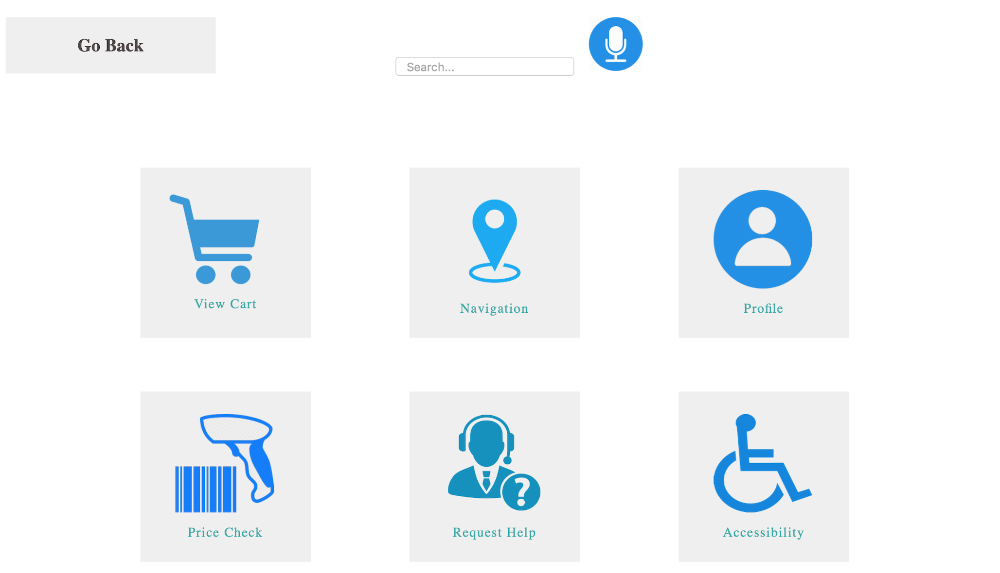
* Created UI diagram for when user if kicked out if user not in session.
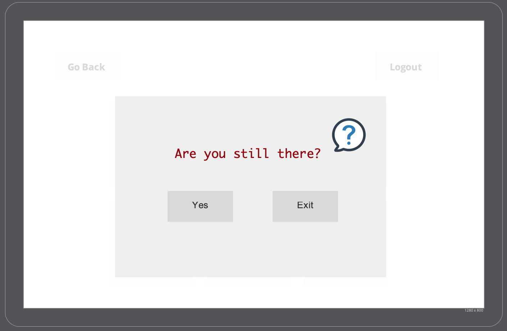
* Make UI/UX diagrams for mobile devices
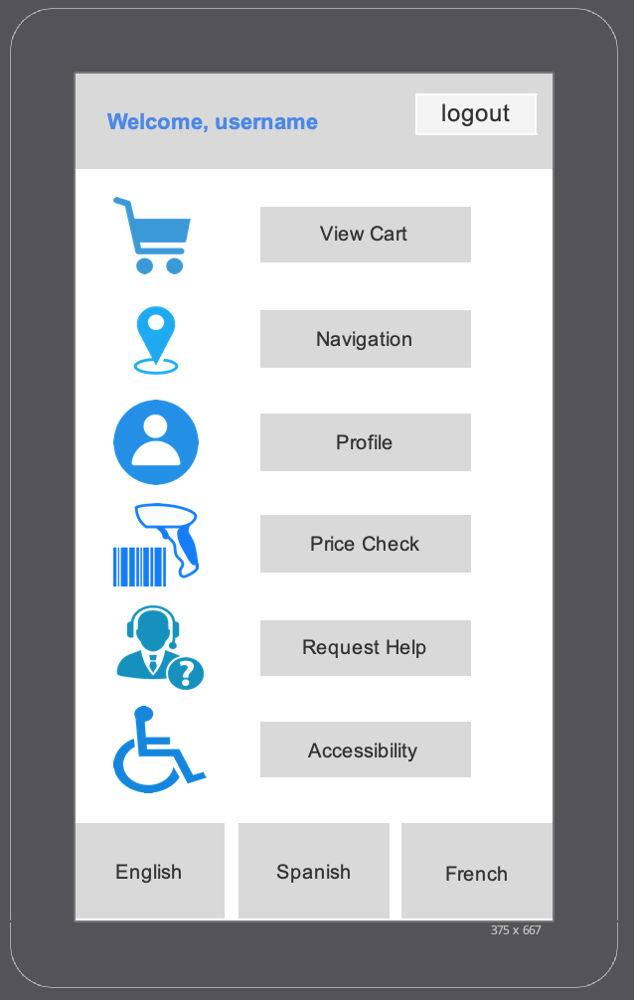
* Created other UI/UX diagrams for other screens and relayed information to developing team.

## Developer Report

List all atomic goals for the Developer for this sprint and the artifacts that completed them.  Explain development assumptions and or any derivations from the initial User/Admin story.

* Create a html page for Admin/Human Resources with editing the CSS file.
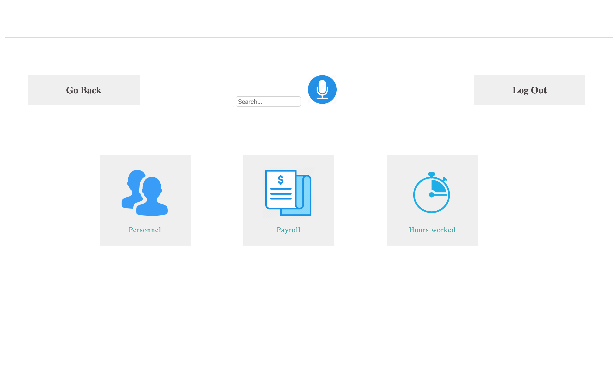
* Create a html page for Admin/Accounting with editing the CSS file.
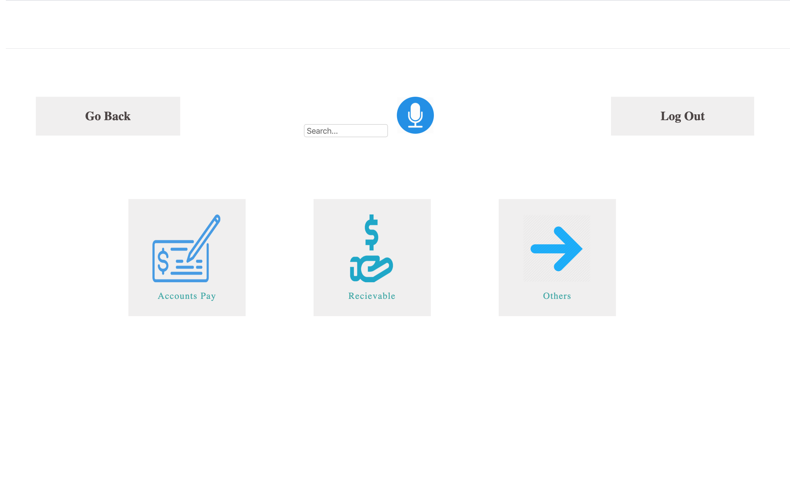
* Create a html page for Admin/Vendor with editing the CSS file.
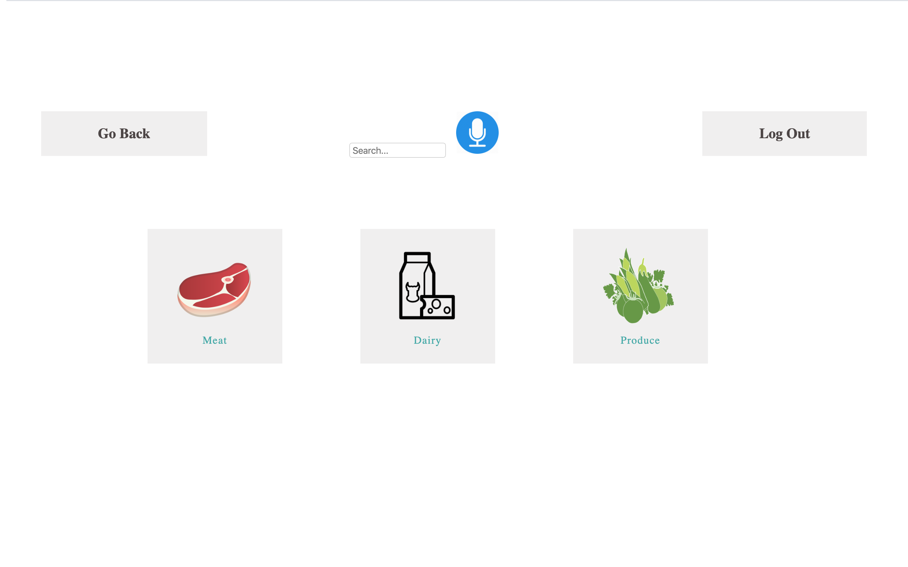
* Create a html page for Admin/Advertisement with editing the CSS file.
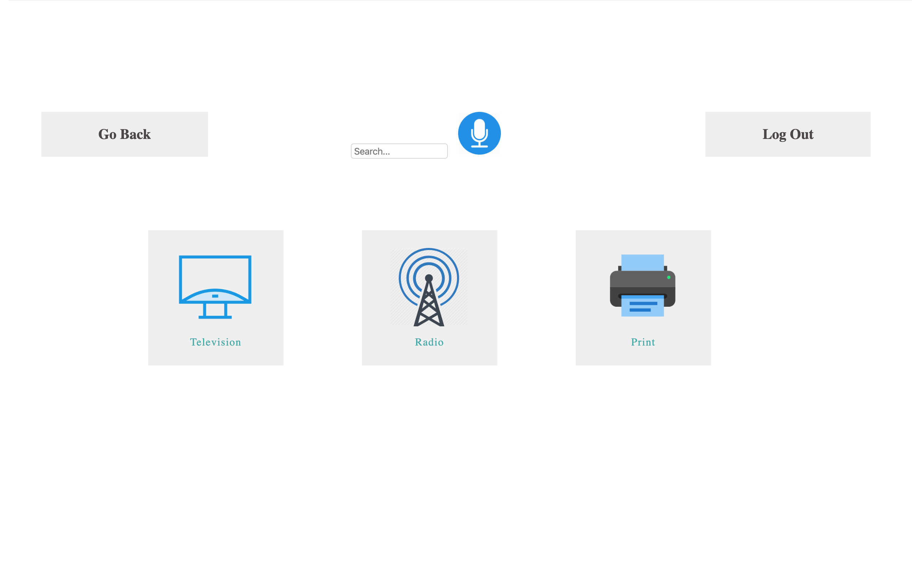
* Create a html page for Admin/Promotions with editing the CSS file.
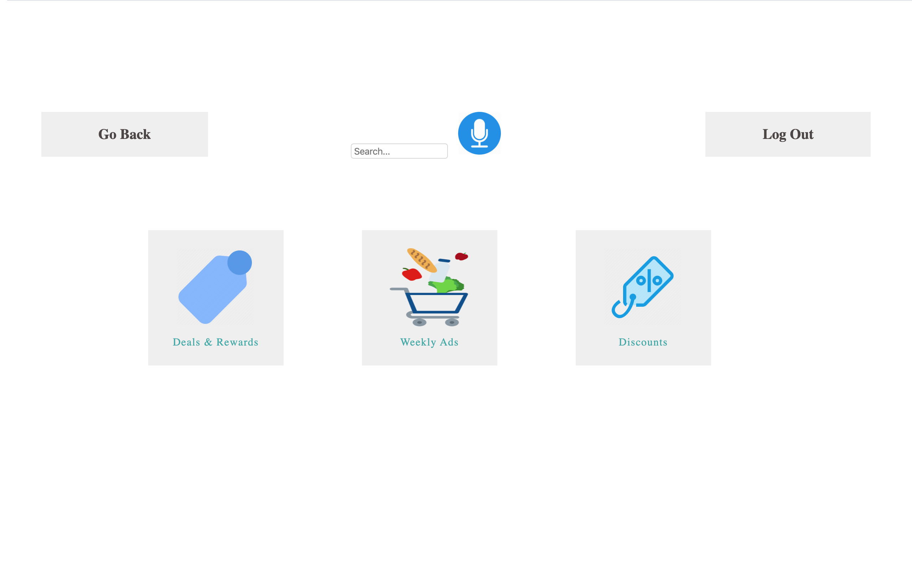
* Create a html page for Admin/Inventory with editing the CSS file.
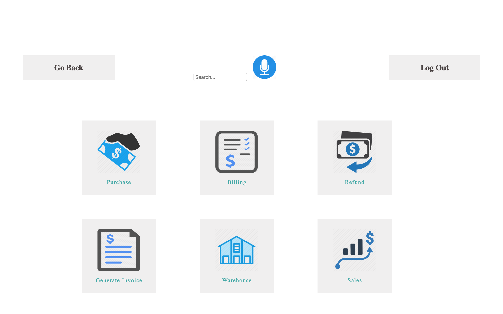

## IT Infrastructure Report

List all atomic goals for the Infrastructure for this sprint and the artifacts that completed them. 

* Explain the IT/OS assumptions made and or any derivations from the initial User/Admin story.

    * We will be using Android Operating System on Amazon Fire Tablet.

* Explain the Load Balancing and Master/Slave Datastore that will be used in web application. 

    * Load balancing is a process of the traffic navigation and workload distribution across multiple components, which is performed by the dedicated type of nodes called load balancers. 

    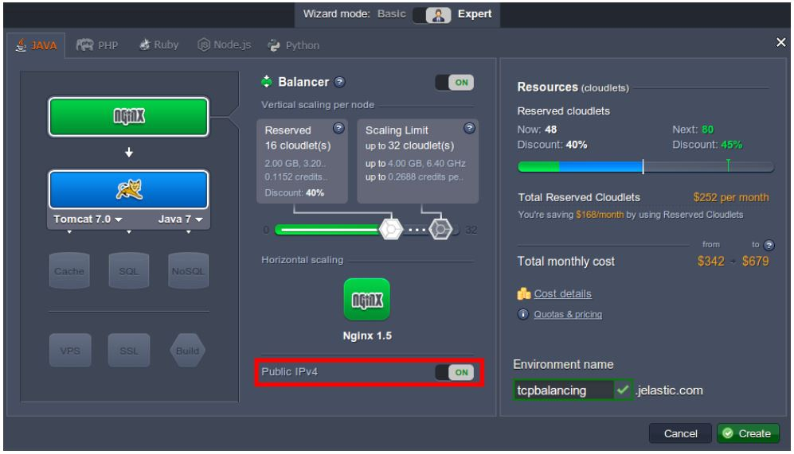

    We will be using Jelastic TCP Load Balancer. TCP load balancing component receives a connection request from a client app through a network socket. This component decides which node in the environment receives the request. When the connection is established, requests from the client app continue to go through the same connection to the chosen node. 

    * Master-slave replication enables data from one database server (the master) to be replicated to one or more database servers (the slave). The master logs the updates, which then ripple through to the slaves. The slave outputs a message stating that it has received the update successfully, thus allowing the sending of subsequent updates. 

    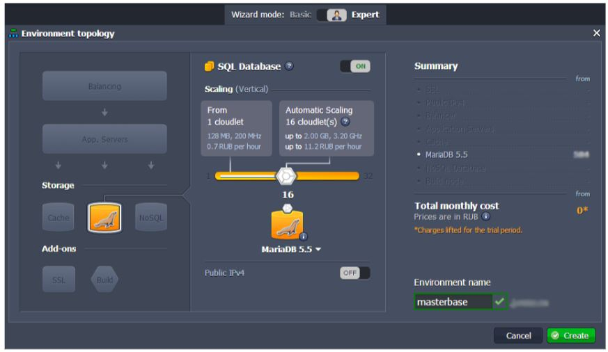

* Create Database Tables in MySQL, based on the Data Schema.
    
    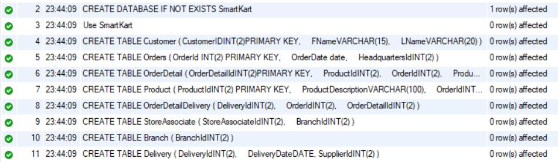 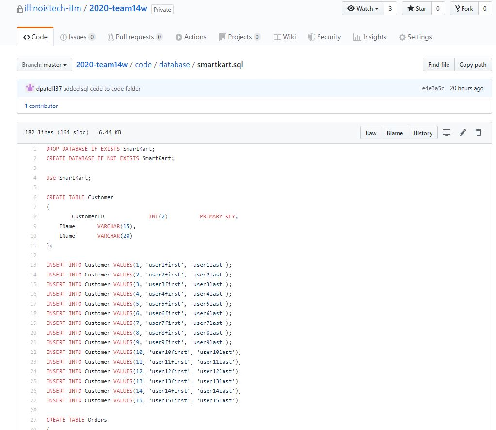

* Explain Login Security Assumptions

    * SQRL (Secure, Quick, Reliable Login) was designed to eliminate username and password authentication to remote websites/apps. When using SQRL, users need only to provide one password to unlock their signing keys, which are stored locally on their device and never disclosed to any website. The password is verified locally on the device that stores the signing keys.
    * To authenticate using SQRL, visitors to a website/app are uniquely identified by an anonymous SQRL ID, which they present every time they visit the same site.
    * While users always present the same ID to the same site, they present an entirely different ID to every other site they visit, so it is impossible to link identities across sites.

* Generate 15 test users. 

    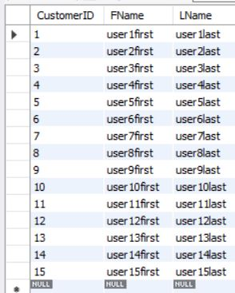 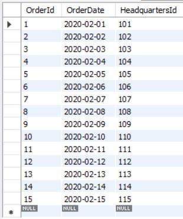 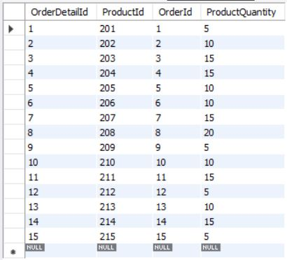 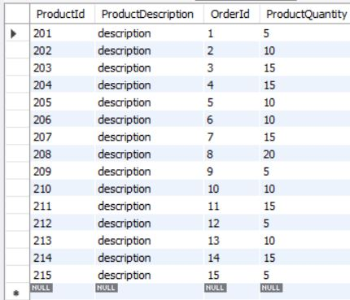 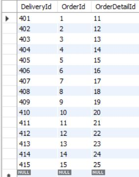 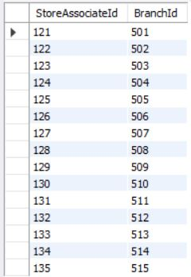 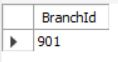 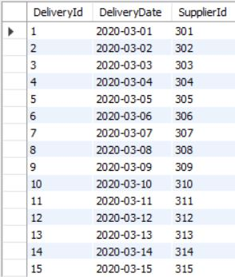 

## Junior Developer and Security Assumptions

List all atomic goals for the Junior Developer and Security Assumptions for this sprint and the artifacts that completed them.  Explain the Junior Developer and Security assumptions made and or any derivations from the initial User/Admin story.

* Make the HTML and CSS pages responsive design.
* Develop detailed notes based on the diagrams from UI/UX Developer.
* Create diagrams of colors, fonts, and other usability feature.
  .png)
  .png)
  .png)
  
