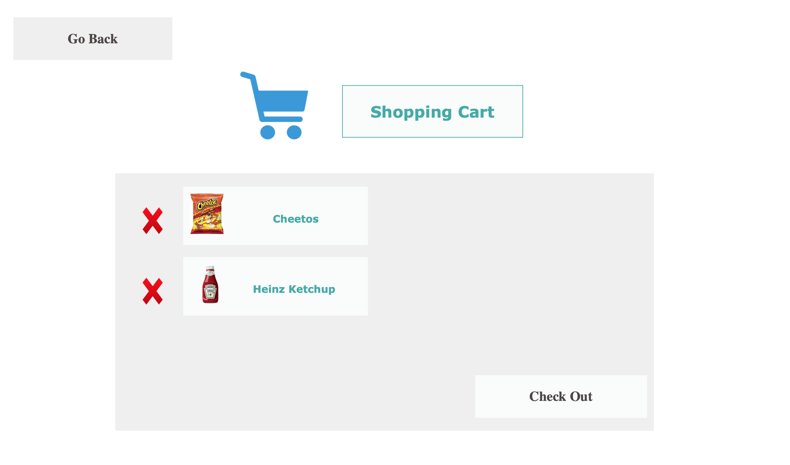
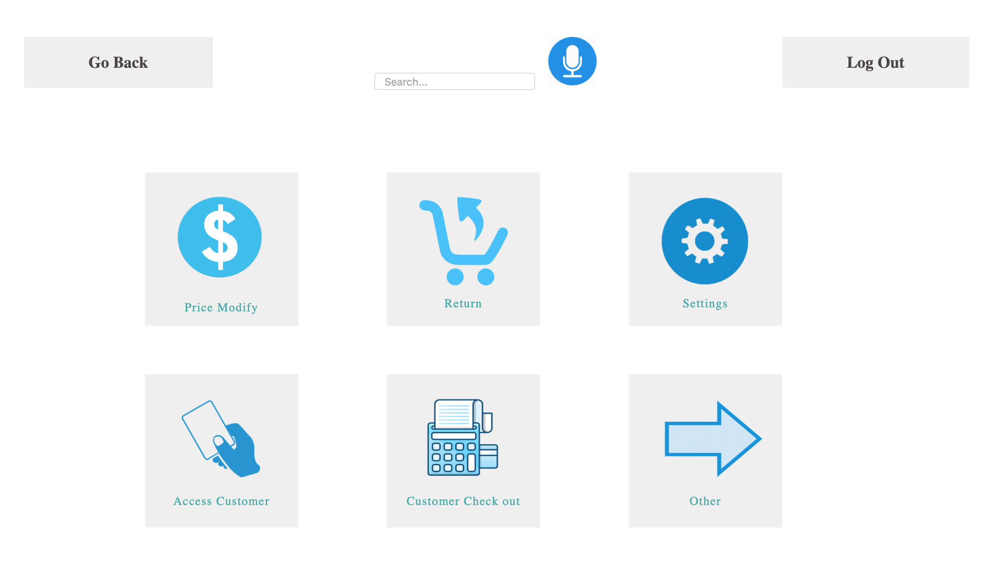
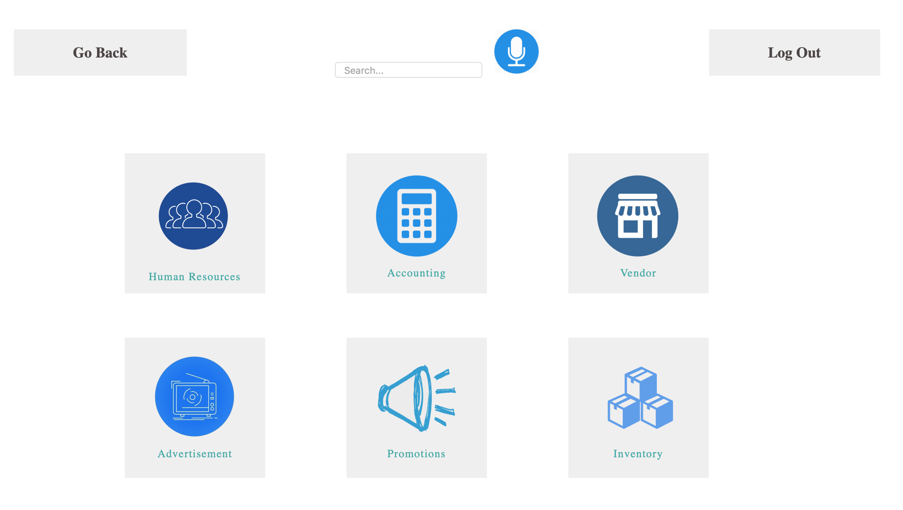

# Sprint-02 Report

## Team 14 - SmartKart

### Team Members
* Developer - Kajal Patel, kpatel115@hawk.iit.edu
  * Responsible for developing code based on UI/UX diagrams
  * Responsible for consistent code commitment for Sprint 1
* UI/UX Developer - Ashma Manandhar, amanandh@hawk.iit.edu 
  * Responsible for designing UI/UX diagrams of the project
  * Creative a testing responsive design
  * Responsible for user testing and filing of issue on GitHub Issues
* Project Manager - Ramzee Christiel, rchristiel@hawk.iit.edu
  * Responsible for managing goals, communication methods, and achieving set goals
  * Responsible for getting resources for the team
  * Responsible for preparing Reports and documentations
  * Responsible for allocating issues and issues tracking on GitHub
* Jr. Developer - Aurangzeb Razzaq, arazzaq@hawk.iit.edu 
  * Responsible for working with Developer to develop code 
  * Working with UI/UX developer to assist with User Interface diagrams
  * Testing the initial developed code for security vulnerabilities
* IT Operations - Darsh Patel, dpatel137@hawk.iit.edu
  * Responsible for ensuring and deploying infrastructure and code
  * Responsible for ensuring al team members can deploy code locally
  * Drawing Infrastructure diagrams 

 ## UI/UX Report
  * 

## Developer Report
  * 

## IT Infrastructure Report
  * 
  Data Schema
  

  IT Infrastructure
  

## Jr. Developer
  * 
  * Homepage: 
    * A background image of a grocery store
    * “Tap to Start” click symbol in the middle 
    * Choose the language to continue shopping 
      * English
      * French
      * Spanish 
  * Index page:
    * Top right hand side: a microphone symbol to continue shopping by voice recording
    * Total of 6 symbol that leads into their own individual page
      * Shopping card: The items scanned then placed into the shopping cart
      * Navigation: Search for the item to see its location 
      * Account: Log in to your account using username & Password to get discounted prices
      * Price check: Simply scan the barcode of a product to see the price
      * Help: Call a Customer Service Representative for any help
      * Disability/senior: Call a Customer Service Representative for any help 

## Project Manager Report
  * Created and managed tasks in Trello.
  * Communicated with Team members for goal setting and deadlines using email.
  * Suggested online software/website options for creating Infrastructure and Database diagrams.
  * Created GitHub folders in team Repository as per Professor Jeremy's requirements and added diagrams 
  to the GitHub that were provided to me by team members.
  * Prepared the 'Sprint 1 Written Report'.
  * Created a User Story to present for Sprint 1 presentations. 
  * Checked for bugs and issues on GitHub.   
  * Documented each task that was accomplished by each team member to ensure completion of Sprint 1 successfully.  

## Developer and Security Assumptions
We will be using SQRL (Secure, Quick, Reliable, Login) for secure website login and authentication. It is an open, free, intellectual property unencumbered, complete and practical system to cryptographically authenticate the identity of individuals across a network. SQRL may be used alongside other traditional website sign-in systems, and it can replace all other systems while offering dramatic improvements in usability and security. 

## Customer Story
A customer is in a rush and wants to buy some snacks at Walmart. As soon as he enters the store, he notices a shopping cart which has a tablet device attached to it. He walks up to the tablet, and sees the following screen:

The customer would have the option to change the language if he wants to. This customer keeps the default English language and taps 'Touch To Start'. Once he taps the that button, he sees the following screen:

Then, he clicks on 'Profile'. There is a login page which looks like this:

## Customer Service Story

After logging in with his credentials, he sees the following Customer Service Page:

## Administrator Story
 

As soon as he logs in, he sees the following screen:

## Atomic Goals for Sprint-02

### UI/UX Developer
1. Create UI/UX Diagrams for new features.
2. Test Responsive design for new features.
3. Create diagrams of colors, fonts, and other usability feature.

### Developer
1. Create HTML and CSS pages for each feature in Admin and Customer Service Profiles.
2. Make the HTML and CSS pages responsive design.
3. Select 2 to 3 features and code them to make it work accurately.

### IT Operations
1. Infrastructure diagrams on new technology that will be implemented in our web application
2. Create Database Tables in MySQL, based on the Data Schema.
3. Generate 2 to 4 real test users. 

### Project Manager
1. User Story in depth (including more features that a user can use, such as Price Check). 
2. Learn to manage JIRA and implement Agile project management.
3. Resolve GitHub issues for code or diagrams. 

### Jr. Developer
1. Research on how we will be implementing Secure Transaction method in our Web App.
2. Check for bugs or security issues/vulnerabilities in the code.
3. Develop detailed notes based on the diagrams from UI/UX Developer.

## References
* Professor Jeremy Hajek
* https://www.theverge.com/2019/1/10/18177020/caper-labs-smart-shopping-cart-image-recognition-weight-sensor
* https://www.engadget.com/2019/01/11/caper-smart-shopping-cart/
* https://www.justinmind.com/
